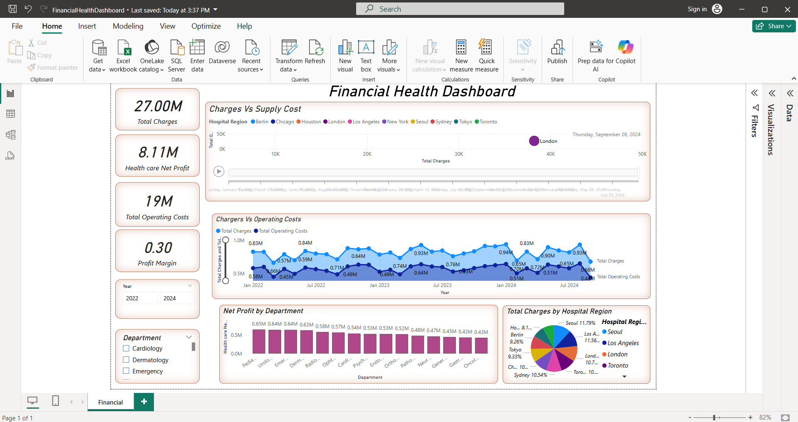

# CodeAlpha_FinancialHealthDashboard

## Project: Financial Health Dashboard

###  Objective:
To create an interactive Power BI dashboard that analyzes a hospital's financial performance over time, including total charges, supply costs, operating costs, and department-wise profitability.

---

## Features:

- Dynamic visuals showing:
  - Charges vs Supply Cost by Hospital Region
  - Charges vs Operating Costs over time
  - Net Profit by Department
  - Total Charges by Hospital Region
- KPI cards for:
  - Total Charges
  - Health Care Net Profit
  - Operating Costs
  - Profit Margin
- Filters for:
  - Year
  - Department

---

## Tools Used:
- Microsoft Power BI
- Mock dataset (Excel/CSV)
- DAX for KPIs and calculated fields

---

## Insights:

- Total Charges (27M): Strong overall billing across all hospitals.
- Net Profit (8.11M): Healthy profitability after accounting for operations.
- **Operating Costs (19M): Controlled spending relative to income.
- **Profit Margin (30%): Indicates financial efficiency.

### Regional & Departmental Observations:
- Toronto and Seoul have high total charges — potential high-profit regions.
- Pediatrics, Urology, and Radiology are top profit-generating departments.
- Seasonal charge peaks in July 2022 and July 2023 — possible links to service demand spikes.
- Oncology and Gastroenterology show lower profitability — may need review.

---

## Recommendations:

- Invest more in high-profit departments and regions.
- Optimize supply costs in large hospitals.
- Use trend insights to forecast demand and plan staffing/inventory.

---

## Dax and Calculated Fields

**Calculated Fields:**

EstimatedCashFlow = 
    'HealthcareFinancialData'[Charges] 
    - 'HealthcareFinancialData'[Operating Costs] 
    - 'HealthcareFinancialData'[Supply Cost] 
    - 'HealthcareFinancialData'[Tax]

    
**Dax Fields:**

Health care Net Profit = SUM('HealthcareFinancialData'[Net Profit])

Profit Margin = DIVIDE([Health care Net Profit], [Total Charges], 0)

Total Charges = SUM('HealthcareFinancialData'[Charges])

Total Insurance Discount = SUM('HealthcareFinancialData'[Insurance Discount])

Total Operating Costs = SUM('HealthcareFinancialData'[Operating Costs])

Total Patients = SUM('HealthcareFinancialData'[Patients Billed])

Total Supply Cost = SUM('HealthcareFinancialData'[Supply Cost])

## Screenshots:

---

##  LinkedIn Post:
[View My LinkedIn Submission](https://www.linkedin.com/in/archana-kandi-536b86348/)

##  GitHub Repository:
[View Repository](https://github.com/ArchanaKandi/CodeAlpha_FinancialHealthDashboard)

